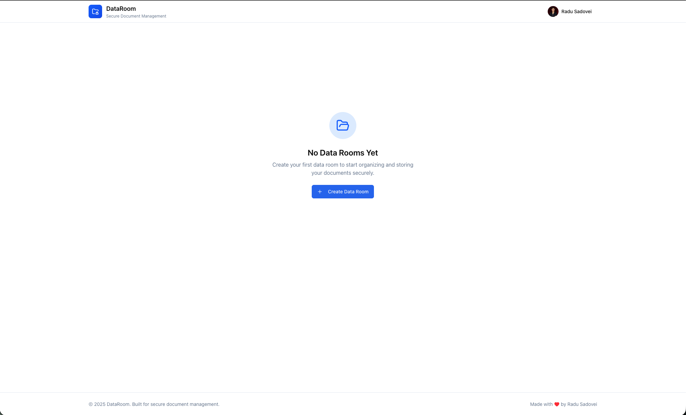

# DataRoom - Secure Document Management

A modern, secure virtual data room application built with Next.js 14 for organizing and managing documents. This MVP was built as a take-home project demonstrating React/TypeScript best practices.



## 🚀 Live Demo

[View Live Demo](https://dataroom-app-vercel-57roxrrw6-sadoveis-projects.vercel.app/)

[View on GitHub](https://github.com/Sadovei/dataroom-app)

## ✨ Features

### Core Functionality
- **Google OAuth Authentication**: Secure login with Google via Supabase Auth
- **Data Rooms**: Create multiple data rooms to organize different projects/deals
- **Folder Management**: Create nested folders with unlimited depth
- **File Upload**: Upload PDF files with drag-and-drop support (stored in Supabase Storage)
- **PDF Preview**: View PDF documents directly in the browser
- **Search**: Real-time search across files and folders
- **View Modes**: Toggle between grid and list views

### Edge Cases Handled
- Duplicate file/folder name detection with auto-renaming
- File type validation (PDF only)
- File size limits (50MB max)
- Invalid character detection in names
- Empty state handling
- Confirmation dialogs for destructive actions

### UX Features
- Responsive design (mobile-friendly)
- Dark mode ready (CSS variables configured)
- Keyboard navigation support
- Toast notifications for actions
- Loading states
- Breadcrumb navigation

## 🛠 Tech Stack

- **Framework**: Next.js 14 (App Router)
- **Language**: TypeScript
- **Styling**: Tailwind CSS v4
- **UI Components**: shadcn/ui
- **State Management**: Zustand
- **Backend**: Supabase (Auth + PostgreSQL + Storage)
- **Icons**: Lucide React

## 📁 Project Structure

```
src/
├── app/                    # Next.js app router pages
│   ├── auth/callback/     # OAuth callback handler
│   ├── login/             # Login page
│   ├── globals.css        # Global styles with CSS variables
│   ├── layout.tsx         # Root layout with AuthProvider
│   └── page.tsx           # Main page
├── components/
│   ├── dataroom/          # Data room components
│   │   ├── DataRoomAppSupabase.tsx  # Main app with Supabase
│   │   ├── DataRoomList.tsx         # Data room cards grid
│   │   └── FileExplorer.tsx         # File/folder explorer
│   ├── dialogs/           # Modal dialogs
│   │   ├── CreateDataRoomDialog.tsx
│   │   ├── CreateFolderDialog.tsx
│   │   ├── DeleteDialog.tsx
│   │   ├── PDFPreviewDialog.tsx
│   │   └── RenameDialog.tsx
│   ├── layout/            # Layout components
│   │   └── Header.tsx
│   └── ui/                # shadcn/ui components
├── contexts/
│   └── AuthContext.tsx    # Auth context provider
├── lib/
│   ├── supabase/          # Supabase client configuration
│   │   ├── client.ts      # Browser client
│   │   ├── server.ts      # Server client
│   │   └── middleware.ts  # Auth middleware
│   └── utils.ts           # Utility functions
├── store/
│   └── supabase-store.ts  # Supabase-backed store with Zustand
└── types/
    └── index.ts           # TypeScript type definitions
supabase/
└── schema.sql             # Database schema with RLS policies
```

## 🚦 Getting Started

### Prerequisites

- Node.js 18+ 
- npm or yarn
- Supabase account (free tier works!)

### Supabase Setup

1. Create a new project at [supabase.com](https://supabase.com/dashboard)

2. Run the database schema:
   - Go to SQL Editor in your Supabase dashboard
   - Copy and paste the contents of `supabase/schema.sql`
   - Click "Run"

3. Enable Google OAuth:
   - Go to Authentication > Providers > Google
   - Enable Google provider
   - Add your Google OAuth credentials (Client ID and Secret)
   - Get credentials from [Google Cloud Console](https://console.cloud.google.com/apis/credentials)

4. Configure redirect URLs:
   - In Supabase Auth settings, add:
     - `http://localhost:3000/auth/callback` (for development)
     - `https://dataroom-app-vercel-57roxrrw6-sadoveis-projects.vercel.app/auth/callback` (for production)

### Local Installation

1. Clone the repository:
```bash
git clone https://github.com/Sadovei/dataroom-app.git
cd dataroom-app
```

2. Install dependencies:
```bash
npm install
```

3. Create `.env.local` file:
```bash
cp .env.example .env.local
```

4. Add your Supabase credentials to `.env.local`:
```env
NEXT_PUBLIC_SUPABASE_URL=https://your-project-ref.supabase.co
NEXT_PUBLIC_SUPABASE_ANON_KEY=your-anon-key
```

5. Run the development server:
```bash
npm run dev
```

6. Open [http://localhost:3000](http://localhost:3000) in your browser.

### Build for Production

```bash
npm run build
npm start
```

### Deploy to Vercel

1. Push your code to GitHub
2. Import project in Vercel
3. Add environment variables:
   - `NEXT_PUBLIC_SUPABASE_URL`
   - `NEXT_PUBLIC_SUPABASE_ANON_KEY`
4. Deploy!

## 🎯 Design Decisions

### 1. State Management with Zustand
Chose Zustand over Redux for its simplicity and minimal boilerplate. The store syncs with Supabase for persistence.

### 2. Supabase as Backend
- **Auth**: Google OAuth for secure, passwordless login
- **Database**: PostgreSQL with Row Level Security
- **Storage**: Secure file storage with signed URLs

### 3. Data Structure
```typescript
interface DataRoom {
  id: string;
  name: string;
  description?: string;
  createdAt: Date;
  updatedAt: Date;
}

interface Folder {
  id: string;
  name: string;
  parentId: string | null;  // null = root level
  dataRoomId: string;
}

interface File {
  id: string;
  name: string;
  folderId: string | null;  // null = root level
  dataRoomId: string;
  size: number;
  mimeType: string;
  storageKey: string;
}
```

This flat structure with `parentId` references allows for:
- Efficient querying of items at any level
- Easy recursive operations (delete folder with children)
- Simple breadcrumb generation

### 3. File Storage
Files are stored in Supabase Storage with:
- Secure signed URLs for access
- Row Level Security policies
- 50MB file size limit per upload

### 4. Component Architecture
- **DataRoomApp**: Orchestrates all dialogs and actions
- **FileExplorer**: Handles navigation, search, and item display
- **DataRoomList**: Landing page with data room cards

This separation makes testing easier and follows single-responsibility principle.

### 5. UI/UX Choices
- Used shadcn/ui for consistent, accessible components
- Grid view default with list view option
- Contextual actions via dropdown menus
- Toast notifications for feedback
- Confirmation dialogs for destructive actions

## 🔮 Future Improvements

Given more time, I would add:

1. **Enhanced Features**
   - Move/copy files between folders
   - Multi-select operations
   - File versioning
   - Activity log/audit trail
   - Full-text search in PDFs

4. **Performance**
   - Virtual scrolling for large lists
   - Lazy loading of PDF previews
   - File chunking for large uploads

## 📝 License

MIT

## 👤 Author

Radu Sadovei - [GitHub](https://github.com/Sadovei)
